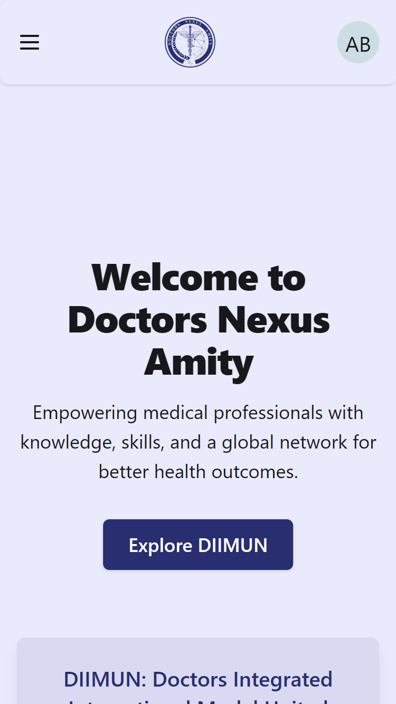
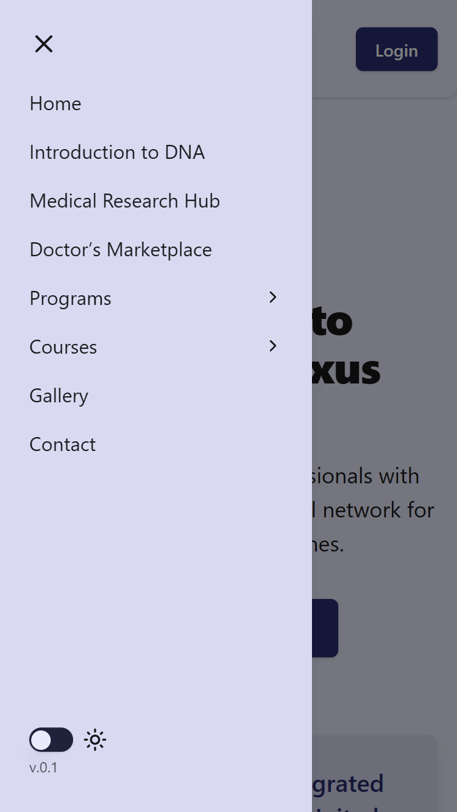
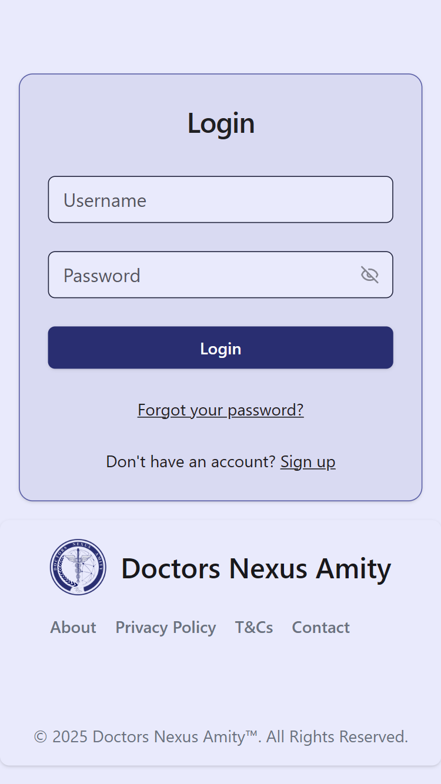
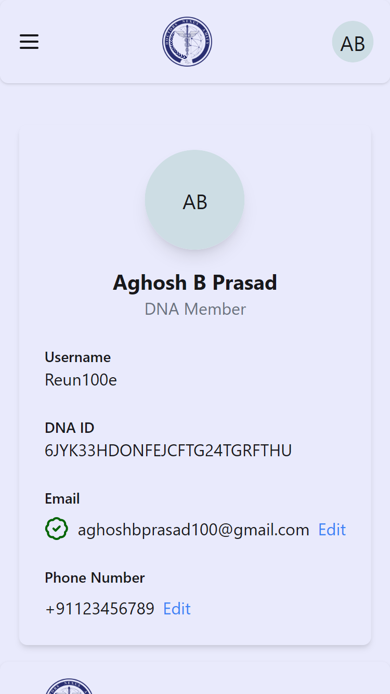
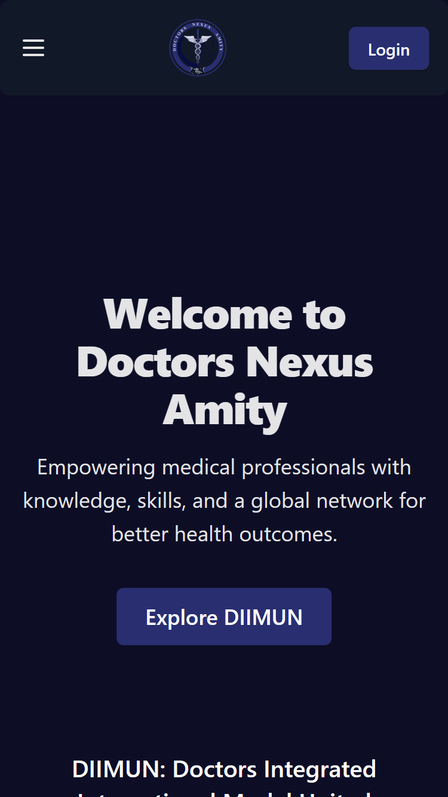
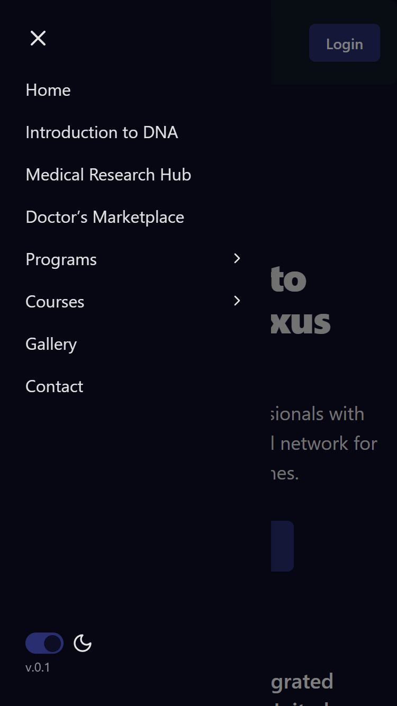
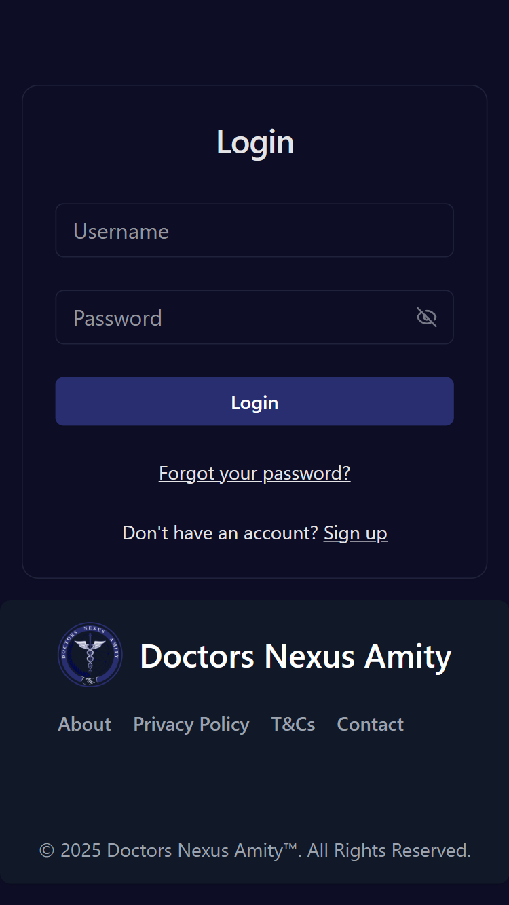
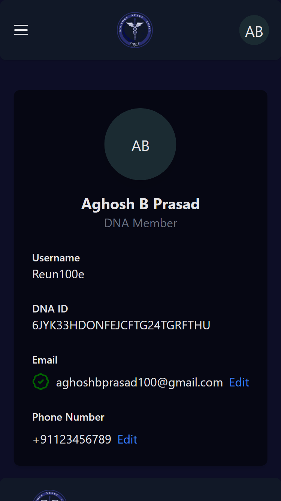
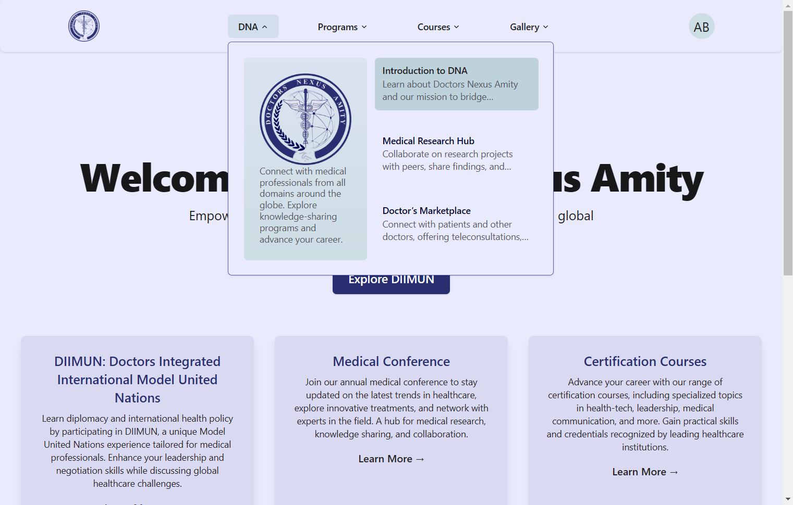
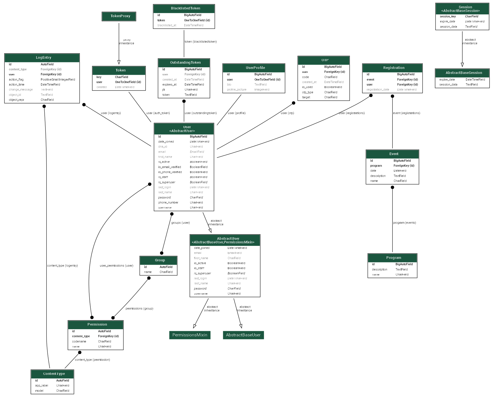

# DNA: Doctors Nexus Amity

## Official repo of DNA web app
Authentication - JWT Http-only cookie
Design System - 2 Tier

### Frontend - React Ts Vite with Shadcn components

### Backend - Django

#### Schema of the backend:

